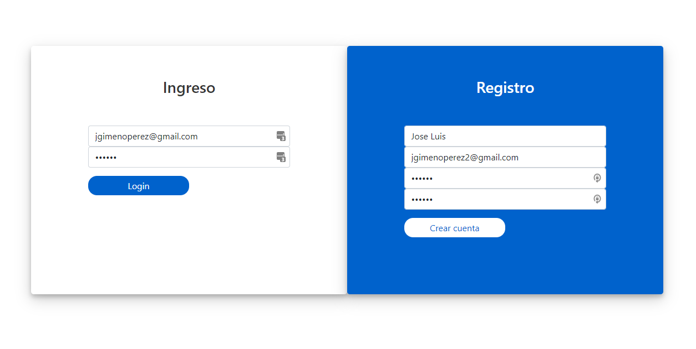
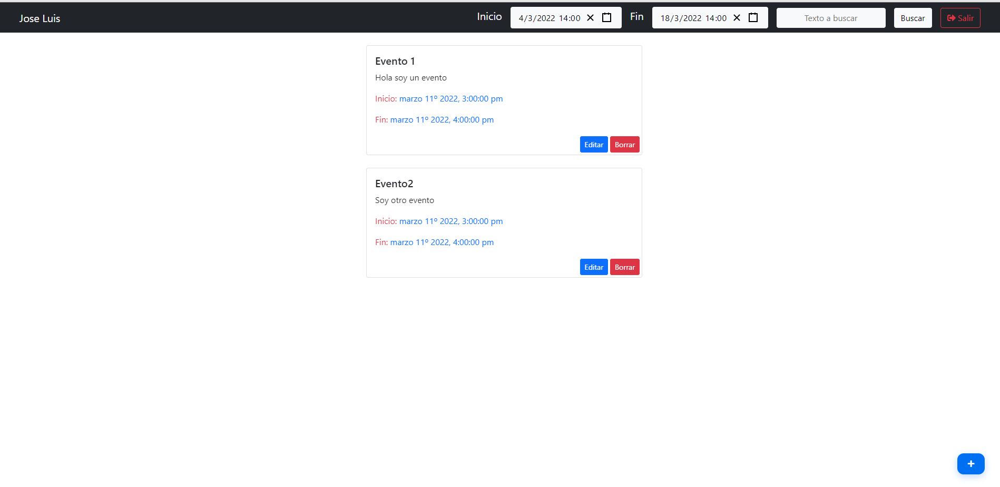

# Agenda Personal
## El stack del proyecto esta conformado por las siguiente tecnologias.

- ### Parte FrontEnd
    - ReactJs 
        #### Parte visual creado mediante la biblioteca ReactJS
        Se han utilizado ademas librerias de terceros como
        - react-router-dom (Gestion de rutas)
        - react-redux (Gestion de estados de la aplicacion)
        - moment (Trabajos con fechas)
        - react-datetime-picker (inputbox del tipo fecha / hora)
        - sweetalert2 (Ventanas modales informativas y de validacion)
        - @nextui-org/react (Libreria para la creacion de layouts)
        - Bootstrap 5 (Biblioteca para diseño)
        - fontawesome (Libreria de iconos)

        Soy consciente de que para un tarea de bajo nivel de complejidad no hubiera sido necesario por ejempolo utilizar REDUX.
        Quizas unicamente con los hooks **useState y usecontext** hubiera sido posible pero he preferido usar **REDUX** unicamente por motivos formativos.

- ### Parte BacKend
    
    La base de datos utilizada es MongoDb.
    He pensado que puede ser una opción comoda ya que no es necesario que instalar ni configurar ningún tipo de servicio de BBDD

    - Express (Libreria para la creacón de un API CRUD)
    - jsonwebtoken (Libreria para el manejo y creación de TOKENS de validación)
    - mongoose (Libreria de comunicacion con MongoDB).
    - express-validator (Libreria para facilitar las validacones en las peticiones API)

## Explicación del proyecto
El proyecto consiste en la creación de diferentes tareas por usuario.
Cada usuario debera de logarse en la aplición, mediante correo y contraseña.
Se realiza una peticion a la aplicacion BACKEND que devolvera un TOKEN que se almacen en el localStorage del navegdor.

Para las posteriores que requieran de validación se utilizara el token almacenado.
Cada usuario podra acceder a sus tareas para leer, editar y borrar (CRUD).

## Como comenzar. 
    - Descargar/Clonar de githuh
    - Acceder a la carpeta ./BackedAgenda
    - Ejecutar yarn install
    - Ejecutar yarn start.
    Si no hay problemas esto arrancaria el servicio de comunicación API con acceso a la BBDD en la nube

    - Acceder a la carpeta ./Agenda
    - Ejecutar yarn install
    - Ejecutar yarn start
    Si todo ha ido bien esto arrancaria la aplicacion WEB

Añado un par de imagenes del aspecto final de la aplicacion.        

